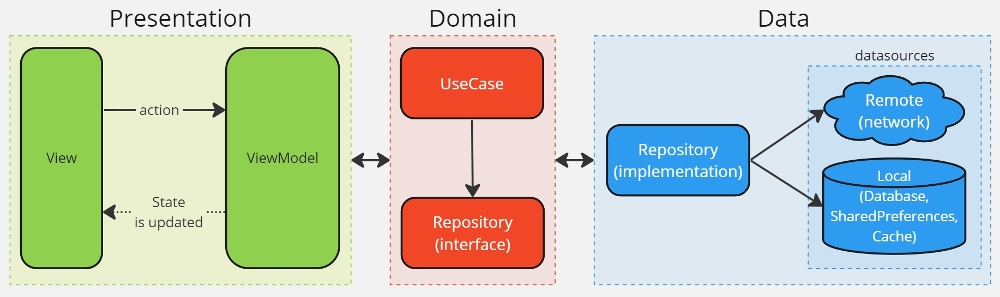

# Gibay

## Introduction

This project showcases Clean Architecture in Flutter, utilizing the MVVM design pattern.

Demo:

## Features

- Clean Architecture
- HTTP client to API REST ([Dio](https://pub.dev/packages/dio))
- Internationalization translations ([Easy localization](https://pub.dev/packages/easy_localization))
- Routing ([Go Router](https://pub.dev/packages/go_router))
- MVVM pattern with [Cubit](https://pub.dev/packages/flutter_bloc) for state management
- Dependency injection ([Get it](https://pub.dev/packages/get_it) and [Injectable](https://pub.dev/packages/injectable)).
- Environment configuration (dev, prod)
- Paged server requests ([Infinite Scroll Pagination](https://pub.dev/packages/infinite_scroll_pagination))

## Environment

The application has two environments and each one has its own configuration file:

- dev: `.env/dev.json`
- prod: `.env/prod.json`

Inside each one, you can find sensitive information that shouldn't be committed to this repository. However, I have included it to provide an easy way to launch this project. Please replace the API key with your own.

## Run and build

To run the application in each environment, you can use the following commands:

- dev: `flutter run --dart-define-from-file=.env/dev.json`
- prod: `flutter run --dart-define-from-file=.env/prod.json`

Also, you can configure your IDE to run the application in each environment.

